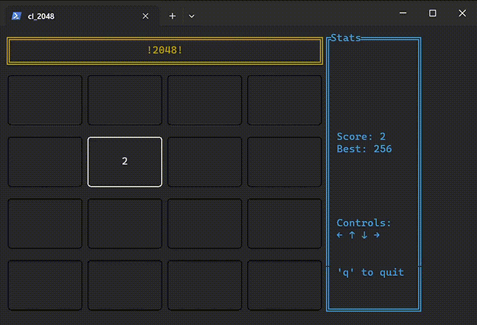

# 2048 in the terminal!
The amazing game 2048, written in rust, using ratatui for the interface. 

## How to run
1. Clone this repo with `https://github.com/AnarchistHoneybun/cl_2048.git`
2. Move to the cloned directory `cd game-2048-tui`
3. Run the game `cargo run` !

## Controls
 - Use the arrow keys (← ↑ ↓ →) to move the blocks around,
   blocks with the same values will be merged on movement. 
 - Use the 'q' key to quit the game before a game over.
 - Get the highest score by merging blocks to create larger numbers.
 - The game ends when you run out of moves.
